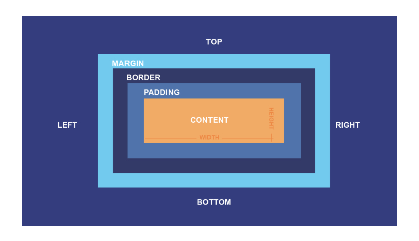

# CSS (Cascading Style Sheets).

CSS is a powerful tool for designing and styling web pages. It allows you to control the visual apperance of your HTML elements and creates visually appealing websites. Here are some Key points to know about CSS

### Seperation of Styles and Structure

Css enables the seperation of the presentation style from the HTML structure. This seperation allows for better organization and maintenance of your code.

### Syntax

CSS uses a set of rule to define styles. Each rule consist of a selector, which target the HTML element(s) you want to style, and declarations, which specify the style properties and their values.

### Cascading and Specificity

CSS follows a cascading principle, meaning styles can be overridden. Specificity determined which style take precedence when conflics occur.

### Selectors

CSS offers a wide range of selectors to target specific elements, including **class selectors**, **ID selectors**, **attributes selectors** and so on. These selectors allow you to apply styles to specific element or group of elements.

### Box Model

CSS incoperates the box model which defines how elements are displayed on the page. Understanding the box modelis essentialfor proper layout and positioning of elements.

.

Remember, CSS is a vast topic, and mastering it requires practice and explanation. It's a powerful that can significantly enhance the visual appeal and user experience of webpages.

### Contact

Contact me @[GitHub](https://github.com/EasyboyJr)